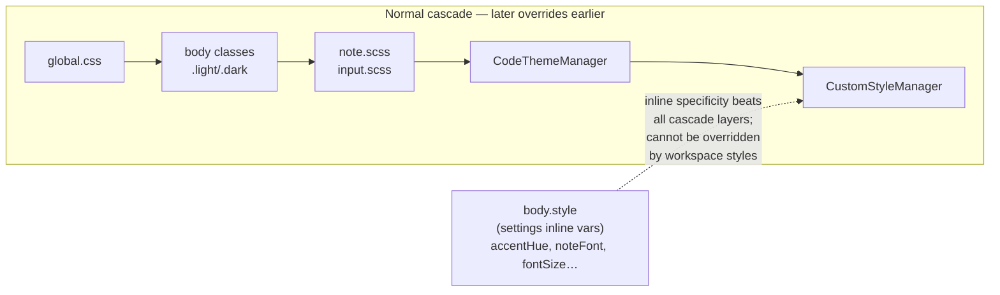
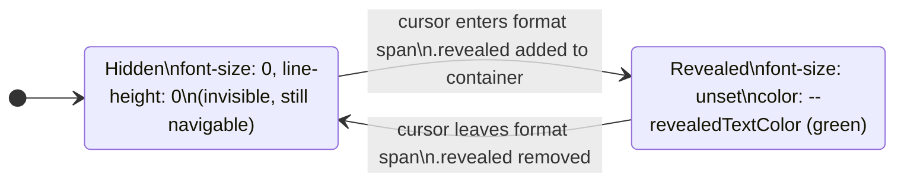
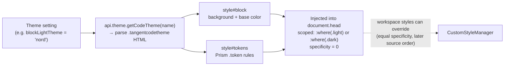

# Tangent Theming Reference

A comprehensive guide to Tangent's CSS theming system — both the application-level UI and note content. Covers every design token, body class, custom style injection point, code theme format, and underlying pattern used to drive visual theming.

---

## Theming Layer Stack

Tangent's theming system composes in layers, each overriding the one below:

```
1. static/global.css          ← Base palette — all CSS custom properties
2. App.svelte (body classes)  ← Mode selectors (.light/.dark/.mac/.win)
3. App.svelte (body.style)    ← User settings as inline CSS vars
4. note.scss / input.scss     ← Component styling consuming tokens
5. CodeThemeManager           ← Injected <style> for syntax highlighting
6. CustomStyleManager         ← User workspace styles (styles/*.css)
```



Later layers win. Custom workspace styles sit at the top and can override anything below, including code themes. The only thing custom styles cannot pierce is Shadow DOM (`t-embed`, `t-checkbox`).

---

## Design Token Reference

All tokens are CSS custom properties. Unless noted, they are defined in `static/global.css` under `:where(:root), :where(.light)` and are available everywhere in the renderer.

### Structural tokens

| Token                 | Default (light)           | Notes                                                                      |
| --------------------- | ------------------------- | -------------------------------------------------------------------------- |
| `--topBarHeight`      | `36px`                    | Height of the top bar / titlebar area                                      |
| `--borderRadius`      | `.75rem`                  | Default card/panel corner radius                                           |
| `--inputBorderRadius` | `4px`                     | Smaller radius for inputs and buttons (defined in `input.scss`)            |
| `--scrollBarWidth`    | `4px` / `8px` / `12px`    | Set by App.svelte from settings: Small=4, Medium=8, Large=12; Windows only |
| `--indentSize`        | `8`                       | Indent depth in space-width units                                          |
| `--spaceWidth`        | `.25em`                   | Width of one space character; drives `--indentWidth`                       |
| `--indentWidth`       | `calc(8 * .25em)` = `2em` | One indent level; used in list glyphs and blockquote margins               |

### Typography tokens

| Token                    | Default                                                                          | Notes                                                                           |
| ------------------------ | -------------------------------------------------------------------------------- | ------------------------------------------------------------------------------- |
| `--fontFamily`           | `system-ui, sans-serif`                                                          | UI / panel font                                                                 |
| `--codeFontFamily`       | `'FiraCode-Retina', FiraCode, Consolas, Menlo, Monaco, 'Courier New', monospace` | Bundled FiraCode; falls back to system monospace                                |
| `--noteFontFamily`       | unset (inherits `--fontFamily`)                                                  | Set inline by App.svelte from `noteFont` setting                                |
| `--fontSize`             | `var(--noteFontSize)`                                                            | Note editor font size; set inline from `noteFontSize` (px)                      |
| `--noteFontSize`         | `16px`                                                                           | Declared in `note.scss :root`; fallback when App.svelte hasn't set `--fontSize` |
| `--baseline`             | `1.5`                                                                            | Line-height multiplier; set inline from `lineHeight` setting                    |
| `--headerFontSizeFactor` | `2.5`                                                                            | Declared in `note.scss :root`; not currently used in calculations               |

`font-size` on `body` (not a custom property) is set inline from `uiFontSize` in points, scaling the entire UI independently of notes.

### Color tokens — surface and text

| Token                            | Light                     | Dark                      |
| -------------------------------- | ------------------------- | ------------------------- |
| `--backgroundColor`              | `#f6f6f6`                 | `#323232`                 |
| `--transparentBackgroundColor`   | `rgb(from bg r g b / .8)` | `rgb(from bg r g b / .5)` |
| `--noteBackgroundColor`          | `white`                   | `#1e1e1e`                 |
| `--embossedBackgroundColor`      | `#f7f7f7`                 | `#151515`                 |
| `--borderColor`                  | `#e5e5e5`                 | `#3d3d3d`                 |
| `--textColor`                    | `#252525`                 | `#ccc`                    |
| `--deemphasizedTextColor`        | `#575757`                 | `#9a9a9a`                 |
| `--heavilyDeemphasizedTextColor` | `#858585`                 | `#686868`                 |
| `--iconStroke`                   | `#414141`                 | `#cecbcb`                 |
| `--buttonBackgroundColor`        | `#e9e9e9`                 | `#4c4c4c`                 |
| `--buttonHoverColor`             | `#e5e5e5`                 | `#565656`                 |

### Color tokens — accent

The accent system is fully HSL-driven and updates live when the user changes hue or saturation in settings.

| Token                                 | Light                     | Dark                             |
| ------------------------------------- | ------------------------- | -------------------------------- |
| `--accentHue`                         | `141`                     | (same; overridden inline)        |
| `--accentSaturation`                  | `67%`                     | (same; overridden inline)        |
| `--accentLightness`                   | `55%`                     | `25%`                            |
| `--accentBackgroundColor`             | `hsl(H, S, L)`            | `hsl(H, S, L)` — dark L is lower |
| `--accentDeemphasizedBackgroundColor` | `hsla(H, S, L, .3)`       | `hsla(H, S, 34%, .3)`            |
| `--accentActiveBackgroundColor`       | `hsl(H, S, 48%)`          | `hsl(H, S, 20%)`                 |
| `--accentTextColor`                   | `hsl(H, S, 35%)`          | `hsl(H, S, 60%)`                 |
| `--deemphasizedAccentTextColor`       | `hsl(H, S, 25%)`          | `hsl(H, calc(S*.8), 40%)`        |
| `--accentLastThreadColor`             | `hsl(H+60, S*.5, L)`      | `hsl(H+60, S, 30%)`              |
| `--accentLastLastThreadColor`         | `hsl(H+120, S*.333, 45%)` | `hsl(H+120, S*.666, 35%)`        |

`--accentHue` and `--accentSaturation` are overridden as inline `body.style` properties when user settings differ from the defaults. `--accentLightness` is defined only in `global.css` (light/dark blocks) and is **not** user-settable.

### Color tokens — links

| Token                  | Light              | Dark               |
| ---------------------- | ------------------ | ------------------ |
| `--externalLinkColor`  | `rgb(0, 100, 200)` | `rgb(0, 150, 250)` |
| `--untrackedLinkColor` | `#6d00c6`          | `#a864e0`          |
| `--emptyLinkTextColor` | `#9b321f`          | `#d65a49`          |

### Color tokens — selection and interaction

| Token                               | Light                          | Dark                              |
| ----------------------------------- | ------------------------------ | --------------------------------- |
| `--selectionBackgroundColor`        | `var(--accentBackgroundColor)` | `rgba(255,255,255,.16)`           |
| `--keySelectionBackgroundColor`     | `rgba(0,0,0,.1)`               | `rgba(255,255,255,.08)`           |
| `--selectionPressedBackgroundColor` | `rgba(0,0,0,.2)`               | `rgba(255,255,255,.13)`           |
| `--dropTargetBackgroundColor`       | `var(--accentBackgroundColor)` | `var(--selectionBackgroundColor)` |
| `--dropTargetChildBackgroundColor`  | `rgb(0 0 0 / .1)`              | `rgba(255,255,255,.05)`           |

Text selection (the browser `::selection` pseudo-element) uses a fixed blue — `hsl(210, 100%, 87%)` active / `hsl(210, 50%, 87%)` inactive in light; `hsl(210, 33%, 30%)` / `hsl(210, 8%, 30%)` in dark — defined directly in `global.css`, not as custom properties.

### Color tokens — highlights

Six named highlight colors plus a "default" alias:

| Token                        | Light                           | Dark          |
| ---------------------------- | ------------------------------- | ------------- |
| `--highlightRedBGColor`      | `#fa9d9d`                       | `#ed5454`     |
| `--highlightOrangeBGColor`   | `#fcbd89`                       | `#f48b35`     |
| `--highlightYellowBGColor`   | `yellow`                        | `#dfdc30`     |
| `--highlightGreenBGColor`    | `#94eb75`                       | `#94dd3c`     |
| `--highlightBlueBGColor`     | `#a3d2fc`                       | `#4fa9f4`     |
| `--highlightPurpleBGColor`   | `#e7aaff`                       | `#b881e9`     |
| `--highlightBackgroundColor` | `var(--highlightYellowBGColor)` | same          |
| `--highlightTextColor`       | `var(--textColor)`              | not redefined |

### Color tokens — miscellaneous

| Token                      | Light                       | Dark                    | Notes                                                                |
| -------------------------- | --------------------------- | ----------------------- | -------------------------------------------------------------------- |
| `--warningTextColor`       | `rgb(194, 120, 9)`          | `orange`                | Used for warning underlines and labels                               |
| `--revealedTextColor`      | `green`                     | not redefined           | Color of visible markdown syntax characters when cursor reveals them |
| `--templateTokenTextColor` | `var(--untrackedLinkColor)` | same                    | Template `{{token}}` syntax color                                    |
| `--scrollbarColor`         | `rgba(0,0,0,.1)`            | `rgba(255,255,255,.1)`  | Windows custom scrollbar; see `.win` class                           |
| `--scrollbarHoverColor`    | `rgba(0,0,0,.2)`            | `rgba(255,255,255,.2)`  |                                                                      |
| `--scrollbarActiveColor`   | `rgba(0,0,0,.15)`           | `rgba(255,255,255,.15)` |                                                                      |

### Code block tokens

Two tokens are consumed by `note.scss` for code block text but are **not defined in `global.css`** — they are set by `CodeThemeManager` via injected `<style>` tags:

| Token         | Set by                                                 |
| ------------- | ------------------------------------------------------ |
| `--codeColor` | Injected from `.tangentcodetheme` `<style id="block">` |

If no code theme is active, `pre` and `.mathLine` will render without an explicit foreground color (inheriting `--textColor`).

---

## Body Classes Reference

`App.svelte` manages classes on `document.body` reactively. These are the primary theming hooks for anything that needs to vary by mode:

### Static (set once on startup)

| Class               | When set                                                     |
| ------------------- | ------------------------------------------------------------ |
| `.light` or `.dark` | Appearance mode — from settings or OS `prefers-color-scheme` |
| `.mac`              | Running on macOS                                             |
| `.win`              | Running on Windows / Linux                                   |

### Settings-driven

| Class                                 | When set                                           |
| ------------------------------------- | -------------------------------------------------- |
| `.link-cursor-arrow`                  | Link cursor setting = "arrow"                      |
| `.link-cursor-pointer`                | Link cursor setting = "pointer"                    |
| `.link-cursor-directional`            | Link cursor setting = "directional" (default)      |
| `.note-link-click-mod`                | Note link follow = "mod" (default: Ctrl/Cmd+click) |
| `.note-link-click-none`               | Note link follow = "none" (click always follows)   |
| `.link-click-pane-new`                | Click opens link in new pane (default)             |
| `.link-click-pane-replace`            | Click replaces current pane                        |
| `.collapse-embed-link-lines`          | Collapse embed syntax lines when unfocused         |
| `.margins-tight` / `.margins-relaxed` | Note margin setting (no class = default padding)   |
| `.hangingHeaders`                     | Hanging headers layout option                      |
| `.crossOutFinishedTodos`              | Strike through checked/canceled todo items         |

### Transient (set on keydown, removed on keyup)

| Class            | Key               |
| ---------------- | ----------------- |
| `.meta-pressed`  | Meta (Cmd on Mac) |
| `.ctrl-pressed`  | Control           |
| `.alt-pressed`   | Alt/Option        |
| `.shift-pressed` | Shift             |

These drive cursor style changes in `.note-link-click-directional` and similar interaction rules.

### Application state (internal)

| Class       | When set                                    |
| ----------- | ------------------------------------------- |
| `.focusing` | Set by NoteEditor when focus mode is active |

---

## Settings → CSS Mapping

The following user settings are materialized as inline `body.style.cssText` by `App.svelte`. These are the only properties set as inline style on `body` (bypassing cascade):

| Setting            | CSS output                   | Type                            |
| ------------------ | ---------------------------- | ------------------------------- |
| `accentHue`        | `--accentHue: <n>`           | number (hue degrees)            |
| `accentSaturation` | `--accentSaturation: <n>%`   | number → percent                |
| `noteFont`         | `--noteFontFamily: "<name>"` | font family string              |
| `noteCodeFont`     | `--codeFontFamily: "<name>"` | font family string              |
| `noteFontSize`     | `--fontSize: <n>px`          | number → px                     |
| `uiFontSize`       | `font-size: <n>px`           | number → px (not a custom prop) |
| `lineHeight`       | `--baseline: <n>`            | number (multiplier)             |
| `scrollBarWidth`   | `--scrollBarWidth: 4/8/12px` | "Small"/"Medium"/"Large"        |

Because all settings are inline styles, they take precedence over any token defined in stylesheets. Custom workspace styles **cannot** override them.

---

## Note Content Theming (`article.note`)

Everything inside the note editor is wrapped in `article.note`. All note-specific CSS lives in `src/app/style/note.scss`.

### SCSS utility functions

Two SCSS functions are available throughout `note.scss` (they compile to `calc()` expressions):

```scss
fontUnit($n)    // calc(var(--fontSize) * #{$n})
rhythmUnit($n)  // calc(var(--fontSize) * var(--baseline) * #{$n})
```

`rhythmUnit(1)` = one line height. This is used for padding, margins, and heights everywhere in note styling to keep layout proportional when font size or line height change.

### Note layout

```scss
article.note {
    font-family: var(--noteFontFamily);
    font-size: var(--fontSize);
    line-height: rhythmUnit(1);
    padding: 1em 2em;          // default margins
}
```

Margin variants via body class:

| Body class         | Effect                                                                               |
| ------------------ | ------------------------------------------------------------------------------------ |
| (none)             | `padding: 1em 2em`                                                                   |
| `.margins-tight`   | `padding: .5em; padding-top: 0`; heading margin-bottom removed                       |
| `.margins-relaxed` | `padding: 2em 3em`; headings above first gain top margin; hr gains top/bottom margin |

Hanging headers (`.hangingHeaders`):

```scss
.hangingHeaders article.note {
    .line { padding-inline-start: fontUnit(.5); }
    h1, h2, h3, h4, h5, h6 { &.line { padding: 0; } }
}
```

### Headings

| Element   | Font size | Line height        | Extra                                       |
| --------- | --------- | ------------------ | ------------------------------------------- |
| `h1.line` | `200%`    | `rhythmUnit(1.5)`  | `margin-bottom: rhythmUnit(.5)`, weight 600 |
| `h2.line` | `150%`    | `rhythmUnit(1.25)` | `margin-bottom: rhythmUnit(.25)`            |
| `h3.line` | `120%`    | `rhythmUnit(1)`    |                                             |
| `h4.line` | `100%`    | `rhythmUnit(1)`    |                                             |
| `h5.line` | `85%`     | `rhythmUnit(1)`    | weight 600, underline                       |
| `h6.line` | `85%`     | `rhythmUnit(1)`    | weight 500, italic, underline               |

All heading elements adjust `--spaceWidth` proportionally so that indent calculations remain consistent at different sizes. With `.margins-relaxed`, h1–h3 that are not the first child get `margin-top: rhythmUnit(1)`.

### Blockquote

```scss
blockquote {
    margin-inline-start: 2em;
    border-inline-start: 4px solid var(--deemphasizedTextColor);
    // Depths 1–4 increase border-inline-start-width by 4px each
}
```

The border width thickens with nesting depth (`.depth-1` through `.depth-4`) rather than indenting further. Currently nesting is visual only; the TODO notes that true nested blockquotes would require structural changes.

### List items (`p.list`)

```scss
p.list {
    margin-inline-start: calc((var(--spaceWidth) * var(--lineIndent)) + var(--indentWidth));
    text-indent: calc(-1 * var(--spaceWidth));
}
```

The list glyph (bullet, number, `+`, `-`) is rendered via CSS `::after` on the `.list` span, positioned at `inset-inline-start: calc(-1 * var(--indentWidth))`, using `content: attr(listGlyph)`. The glyph color is `var(--accentTextColor)`. Asterisk glyphs are replaced with `•`.

Checkboxes use the `t-checkbox` web component (Shadow DOM), positioned at `inset-inline-start: calc(-.42 * var(--indentWidth))` with a vertical transform to center it in the line height.

Todo strike-through (when `.crossOutFinishedTodos` is on body):

- `.checked` → `color: var(--deemphasizedTextColor)` + `text-decoration: line-through 1.5px var(--textColor)`
- `.canceled` → `color: var(--deemphasizedTextColor)` + `text-decoration: line-through wavy 1.5px`

Large list items get `margin-top: .5em` when adjacent to non-empty non-list lines.

### Horizontal rule

Rendered as an `::after` pseudo-element: a 1px line at `top: rhythmUnit(.5)`, colored `var(--deemphasizedTextColor)` at 50% opacity. Height of the host element is `rhythmUnit(1)`.

### Front matter

`.frontMatterLine.start` and `.end` render the same 1px separator line as HR. When collapsed, `.start.collapse-parent` shows `--- front matter ---` in italic weight-200 with top and bottom borders.

### Inline code (`code.inline_code`)

```scss
code.inline_code {
    font-family: var(--codeFontFamily);
    color: var(--accentTextColor);  // when not hidden
}
```

HTML inline code overrides: `color: unset` (inherits context color).

### Code blocks (`pre`)

```scss
pre {
    color: var(--codeColor);      // set by CodeThemeManager
    caret-color: var(--codeColor);
    border-radius: var(--borderRadius);
    padding: 0 .5em;
    margin-left: -.5em;
}
```

Background and token colors come entirely from the active code theme. `var(--codeColor)` is injected by `CodeThemeManager` inside a `:where(.light)` or `:where(.dark)` scoped block. See [Code Themes](#code-themes).

The language label at the start of a code fence is `.line_format.code.start`: `font-size: 80%`, `color: var(--deemphasizedTextColor)`.

### Tags (`span.tag`)

Tags use `var(--accentBackgroundColor)` as their pill background. Tag sections alternate between accent-full and accent-deemphasized:

- Odd depths (1, 3, 5): `--accentBackgroundColor` (full)
- Even depths (2, 4, 6): `--accentDeemphasizedBackgroundColor` (30% opacity)

The separator (`.tagSeperator`) uses a CSS `linear-gradient` between the two adjacent section colors, creating a smooth chevron transition effect.

The first section (`.tagSectionDepth-1`) has a left-aligned dot pseudo-element using `var(--noteBackgroundColor)` as its fill, creating the tag "lozenge" shape.

When revealed, the tag shows as an outlined pill: `border: 1px solid var(--accentBackgroundColor)` with asymmetric border-radius.

### Highlights (`mark`)

```scss
mark {
    background: var(--highlightBackgroundColor);  // yellow by default
    color: var(--highlightTextColor);
    border-radius: 1px;
    padding: 0 .1em;
}
```

Color variants: `.red`, `.orange`, `.yellow`, `.green`, `.blue`, `.purple` — each maps to the corresponding `--highlight*BGColor` token.

Circle highlight (`.mark.circle`): `padding: 0 .3em; border-radius: .5em`.

When revealed (cursor inside), the start/end segments lose their inner padding and border-radius to visually join with the unformatted syntax characters.

### Links (`t-link`)

```scss
t-link[link-state="resolved"]   { color: var(--accentTextColor); }
t-link[link-state="empty"],
t-link[link-state="ambiguous"]  { color: var(--emptyLinkTextColor); }
t-link[link-state="external"]   { color: var(--externalLinkColor); }
t-link[link-state="untracked"]  { color: var(--untrackedLinkColor); }
```

The `link-state` attribute is set by the editor on the `t-link` custom element. Wiki-link brackets (`[[` / `]]`) in `t-link[form="wiki"]` are shifted down slightly (`top: -.05em`) for optical alignment.

Cursor and hover underline behavior is entirely driven by the combination of body classes: `.note-link-click-mod`/`.note-link-click-none`, `.link-cursor-*`, `.link-click-pane-*`, and `.shift-pressed`/`.alt-pressed`.

### Embeds (`t-embed`)

```scss
t-embed {
    display: block;
    margin-top: .5em;
    margin-bottom: .5em;
    line-height: rhythmUnit(1);
    font-size: var(--fontSize);
}
```

Error state (`[link-state="error"]`): `color: var(--emptyLinkTextColor)`.

Float variants: `.float-left` and `.float-right` use CSS `float` with 1em margin on the non-float side. The embed content itself (`t-embed.css`) is Shadow DOM; see [Web Components](#web-components-shadow-dom).

Line collapse (`.collapse-embed-link-lines` on body): unfocused embed lines shrink to `line-height: 0; font-size: 0`, leaving only the rendered embed content visible.

### Math

- Block math (`t-math[block]`): `display: block; margin: .5em 0`
- Inline math source (`.math-source`): uses `--codeFontFamily`, colored `var(--accentTextColor)`
- Math line color (`.mathLine`): `var(--codeColor)` (same as code blocks)
- Revealed inline math: `outline: 2px solid var(--textColor); outline-offset: 4px; border-radius: var(--inputBorderRadius)`

### Annotations

Used for query result highlighting inside notes:

```scss
.annotation        { background-color: color(from var(--accentActiveBackgroundColor) srgb r g b / .7); }
.annotation.soft   { background-color: color(from var(--accentDeemphasizedBackgroundColor) srgb r g b / .7); }
.annotation.current { background-color: var(--accentBackgroundColor); }
```

### Comments (markdown `<!-- -->`)

```scss
.comment:not(.token) {
    font-size: 90%;
    color: var(--deemphasizedTextColor);
}
```

### Template tokens

```scss
.templateToken {
    font-family: var(--codeFontFamily);
    color: var(--templateTokenTextColor);  // = --untrackedLinkColor
}
```

### Error / warning underlines

```scss
.error   { border-bottom: 2px solid red; }
.warning { border-bottom: 2px solid orange; }
```

### WYSIWYG hiding pattern

Tangent hides markdown syntax characters when the cursor is elsewhere (WYSIWYG mode). The mechanic:

- `.hidden` elements: `font-size: 0; line-height: 0; tab-size: 0` — invisible but navigable
- `.hidden.revealed` or `.revealed .line.hidden`: restores `font-size: unset; line-height: unset; tab-size: unset`
- `.revealedTextColor` (green) is applied to these characters when revealed

Block reveals use `.revealed` on the container element. Individual inline spans carry `.hidden`/`.revealed`/`.start`/`.end` classes to manage which parts of the syntax are shown when the cursor enters the format span.



### Focus mode

When `.focusing` is on `body`, all lines in `article.note` get `opacity: .5` (with a `1s` transition). Lines with `[data-focus="focused"]` restore `opacity: unset` (`.3s` transition). The `.unfocused` class inside a focused line applies `opacity: .5` to mark de-emphasized inline content.

---

## UI Component Theming

`src/app/style/input.scss` provides global styles for all interactive elements.

### Base inputs and buttons

All `input, button, select, textarea, .button` share:

- `font-family: inherit; font-size: inherit`
- `border: 1px solid var(--borderColor); border-radius: var(--inputBorderRadius)`

Buttons additionally have:

- `background-color: var(--buttonBackgroundColor)`
- Hover: `var(--buttonHoverColor)`
- Active/open: `var(--bgColor_Active)` / `var(--bgColor_Checked)` (defaults to accent colors)
- `color: inherit` — picks up context text color

### Button variants

| Class              | Effect                                                                                             |
| ------------------ | -------------------------------------------------------------------------------------------------- |
| (none)             | Standard button, `--bgColor_Selected` = `--accentBackgroundColor` on hover                         |
| `.subtle`          | Transparent background; hover uses `--buttonHoverColor`; checked uses `--selectionBackgroundColor` |
| `.no-callout`      | Also transparent background (no hover override)                                                    |
| `.relaxed`         | Extra horizontal padding: `.4em 1.2em`                                                             |
| `.active`          | Active state styling: `--accentActiveBackgroundColor`                                              |
| `.open`            | Open/expanded state: `--accentBackgroundColor`                                                     |
| `[checked="true"]` | Checked state: `--accentBackgroundColor`                                                           |

### Layout containers

**`.buttonBar`** — Horizontal flex row of buttons. Buttons get `min-height: 28px; padding: 0 4px` and align centered. `.spacer` inside a buttonBar has `width: 1.5em`.

**`.buttonGroup`** — Flex row (or column with `.vertical`) that trims inner border-radius so adjacent buttons form a seamless group. First child gets start-side radius; last child gets end-side radius.

**`.focusable`** — Adds a transparent 2px outline that appears as `#666` when the element has `.focused` class but not DOM focus; uses accent color when focused.

---

## Custom Workspace Styles

Users can drop `.css` files in `<workspace>/styles/` to customize their workspace.

**`CustomStyleManager`** (`src/app/style/CustomStyleManager.ts`) watches `workspaceSettings.styleFiles` and injects a `<link rel="stylesheet">` for each active file. Path is cache-busted with a timestamp query param so changes are picked up immediately on save.

Custom styles are injected into the main document, so they can target any selector — note editor, panels, sidebars, buttons. They sit at the top of the cascade (no `!important` needed to beat global.css tokens, but inline body.style properties will win).

**What you can override from a custom style:**

- Any CSS custom property not in `body.style` (i.e., all global.css tokens except accent hue/saturation, font families, font size, baseline, and scrollbar width)
- Any element selector — `article.note`, `.line`, `pre`, `t-link`, `span.tag`, etc.
- UI components — buttons, panels, sidebar
- Add brand-new selectors or rules

**What you cannot override from a custom style:**

- The six settings-driven custom properties set as inline style on `body` (see [Settings → CSS Mapping](#settings--css-mapping))
- Shadow DOM internals of `t-embed` and `t-checkbox`
- Code theme token colors injected by `CodeThemeManager` (those are also injected `<style>` tags; specificity is equal, so order determines which wins — code theme `<style>` tags are injected before custom styles)

**Typical use cases:**

```css
/* Override the note background color to a warm cream */
article.note {
    --noteBackgroundColor: #fdf6e3;
    background-color: var(--noteBackgroundColor);
}

/* Widen code blocks edge-to-edge */
article.note pre {
    margin-left: -2em;
    margin-right: -2em;
    border-radius: 0;
}

/* Tighten tag pill padding */
article.note span.tag:not(.token):not(.revealed) span.tagSection {
    padding: .05em .2em;
}

/* Dark accent for a monochrome look */
:root {
    --accentHue: 0;
    --accentSaturation: 0%;
}
```

---

## Code Themes

Tangent uses `.tangentcodetheme` files for syntax highlighting. These are HTML files with embedded `<style>` tags.

### File format

```html
<style id="block">
pre[class*="language-"],
code[class*="language-"] {
    color: #abb2bf;
    background: #282c34;
    text-shadow: 0 1px rgba(0, 0, 0, 0.3);
}
</style>
<style id="tokens">
.token.comment { color: #5c6370; font-style: italic; }
.token.keyword  { color: #c678dd; }
.token.string   { color: #98c379; }
/* ... all Prism token rules ... */
</style>
```

Two required `<style>` elements:

| `id`     | Contents                                                                             |
| -------- | ------------------------------------------------------------------------------------ |
| `block`  | Background and base text color for `pre`/`code` — also sets `--codeColor` if desired |
| `tokens` | Prism `.token.*` rules                                                               |

### Injection

`CodeThemeManager` manages four independent theme slots:

| Slot          | Setting key                | Scope                                        |
| ------------- | -------------------------- | -------------------------------------------- |
| `inlineLight` | `noteCodeInlineLightTheme` | `:where(.light)` — inline code in light mode |
| `inlineDark`  | `noteCodeInlineDarkTheme`  | `:where(.dark)` — inline code in dark mode   |
| `blockLight`  | `noteCodeBlockLightTheme`  | `:where(.light)` — code blocks in light mode |
| `blockDark`   | `noteCodeBlockDarkTheme`   | `:where(.dark)` — code blocks in dark mode   |

Each slot fetches the theme via `api.theme.getCodeTheme(name)`, parses the HTML, and injects two `<style>` tags into `document.head`:

1. One for the `block` style, wrapped in the mode scope selector
2. One for the `tokens` style, wrapped in the mode scope selector

The `:where()` scoping ensures code themes do not affect non-note content and keep specificity at zero (so workspace custom styles can override them).



### Bundled themes

Located in `static/themes/`:

| Theme            | Style                 |
| ---------------- | --------------------- |
| `atom-one-dark`  | Dark, blue-tinted     |
| `atom-one-light` | Light                 |
| `duotone-dark`   | Purple + gold duotone |
| `duotone-earth`  | Brown + cream duotone |
| `duotone-forest` | Green duotone         |
| `duotone-light`  | Light duotone         |
| `duotone-sea`    | Teal + blue duotone   |
| `duotone-space`  | Dark purple + blue    |
| `gruvbox-dark`   | Warm dark             |
| `gruvbox-light`  | Warm light            |
| `nord`           | Arctic blue           |
| `vscode-dark`    | VS Code Dark+         |
| `vscode-light`   | VS Code Light+        |
| `xonokai`        | Dark, high contrast   |

### Writing a custom code theme

1. Create a `.tangentcodetheme` file anywhere accessible to the app (workspace directory is convenient)
2. Add `<style id="block">` with your `pre`/`code` background and base color, plus optionally set `--codeColor`
3. Add `<style id="tokens">` with Prism token rules (any existing Prism theme CSS file is a starting point)
4. Select the theme in Tangent's Appearance settings for the desired slot (light/dark × inline/block)

---

## Mermaid Diagram Theming

Mermaid diagrams are themed via `src/app/style/mermaidStyle.ts`. Because Mermaid hardcodes inline styles on every diagram element, Tangent re-initializes Mermaid every time the appearance mode changes.

`updateMermaidStyle(darkMode: boolean)` reads computed style values from `document.body` at call time and builds a `themeVariables` object:

```ts
mermaid.initialize({
    startOnLoad: false,
    theme: 'base',
    themeVariables: {
        darkMode,
        fontFamily: 'var(--fontFamily)',
        fontSize: 'var(--fontSize)',
        background: style.getPropertyValue('--noteBackgroundColor'),
        primaryColor: style.getPropertyValue('--backgroundColor'),
        primaryTextColor: style.getPropertyValue('--textColor'),
        // Pie chart colors: triples at accentHue, accentHue+120, accentHue-120
        //   at 1.2×, 1.0×, 0.8×, 0.6× accentLightness
        // Git branch colors: 8 hue offsets around accentHue at fixed lightness
        // Mindmap and edge overrides via themeCSS
    }
})
```

Key accent mapping:

- Pie charts use three hue triads (H, H+120, H−120) at four brightness levels
- Git diagram branches use H, H+120, H−120, H+180, H−60, H−90, H−180, H−180
- Branch labels use `var(--textColor)`
- Gantt exclusion background: `black` (dark) or `var(--backgroundColor)` (light)

Mermaid mindmap `.mindmap-node` fill is set to `var(--backgroundColor)` and edge stroke to `var(--borderColor)` via `themeCSS` injection.

Custom workspace styles cannot easily override Mermaid output because Mermaid writes inline styles. Changing Mermaid behavior requires either modifying `mermaidStyle.ts` or using `!important` in custom CSS (which is brittle).

---

## Web Components (Shadow DOM)

Two custom elements use Shadow DOM with their own isolated stylesheets. Custom workspace styles cannot pierce these; they use CSS custom properties inherited from the outer document as their theming bridge.

### `t-checkbox` (`static/t-checkbox.css`)

Renders the todo checkbox icon. All visual tokens are CSS custom properties defined on the `:host`'s `svg`:

| Property           | Default                          | Meaning                                  |
| ------------------ | -------------------------------- | ---------------------------------------- |
| `--boxStroke`      | `var(--accentBackgroundColor)`   | Border color of the checkbox box         |
| `--boxFill`        | `var(--accentBackgroundColor)`   | Fill color of the checkbox box           |
| `--boxFillOpacity` | `0` (unchecked) / `1` (checked)  | Controls fill opacity                    |
| `--checkStroke`    | `white`                          | Color of the checkmark stroke            |
| `--checkOpacity`   | `0` (unchecked) / `1` (checked)  | Controls checkmark visibility            |
| `--cancelStroke`   | `white`                          | Color of the cancel/strikethrough stroke |
| `--cancelOpacity`  | `0` (unchecked) / `1` (canceled) | Controls cancel stroke visibility        |

Canceled state uses a fixed gray (`#666`) for both `--boxFill` and `--boxStroke`, making it independent of the accent color. Custom theming of the checkbox requires setting these properties on the `t-checkbox` element from the outer document.

### `t-embed` (`static/t-embed.css`)

Renders embedded content (website previews, PDFs, images, audio). Uses design tokens inherited from the outer document:

| Property used                  | Source                             |
| ------------------------------ | ---------------------------------- |
| `var(--backgroundColor)`       | Website preview card background    |
| `var(--borderRadius)`          | Website preview card corner radius |
| `var(--deemphasizedTextColor)` | URL text color                     |
| `var(--textColor)`             | (via Shadow DOM CSS inheritance)   |

The website preview layout is a two-column grid: metadata on the left, preview image on the right. The URL bar at bottom uses `text-shadow: var(--backgroundColor) 0 0 4px` to create a subtle fade-out effect over the image.

---

## Global Link and Selection Styles

Defined in `global.css` for anchor elements outside the note editor:

```css
a               { color: var(--externalLinkColor); }
a.local         { color: var(--accentTextColor); }
a.local.deemphasized { color: var(--deemphasizedTextColor); }
a.local.deemphasized:hover { color: var(--accentTextColor); }
a:hover         { text-decoration: underline; }
a:visited       { color: rgb(0, 80, 160); }  /* fixed; not a token */
```

The `a:visited` color is fixed and not token-driven — currently not dark-mode-aware.

---

## Match Highlights (`highlights.scss`)

Search result highlights in note content are handled separately from `mark` highlights:

```scss
.match-highlight::after {
    background: var(--textColor);
    opacity: .25;
}
```

This `::after` overlay approach preserves text readability regardless of the underlying content color.

---

## Custom Theme Recipe

A minimal starting point for a workspace custom theme:

```css
/* Warm sepia light mode */
:where(.light) {
    --backgroundColor: #f5f0e8;
    --noteBackgroundColor: #faf7f0;
    --embossedBackgroundColor: #f0ebe0;
    --textColor: #2c2416;
    --deemphasizedTextColor: #6b5f4e;
    --heavilyDeemphasizedTextColor: #9a8f7e;
    --borderColor: #d9cfc0;
    --buttonBackgroundColor: #e8e0d0;
    --buttonHoverColor: #ddd5c5;
    --accentHue: 30;
    --accentSaturation: 60%;
    --accentLightness: 45%;
}

/* Dark companion */
:where(.dark) {
    --backgroundColor: #2a2218;
    --noteBackgroundColor: #1e1a12;
    --embossedBackgroundColor: #141008;
    --textColor: #d4c9b0;
    --deemphasizedTextColor: #8a7f6e;
    --borderColor: #3a3020;
    --buttonBackgroundColor: #3a3020;
    --accentHue: 30;
    --accentSaturation: 50%;
    --accentLightness: 30%;
}
```

To ship a theme as a workspace default, place it in `<workspace>/styles/` and select it in the workspace's style settings.
